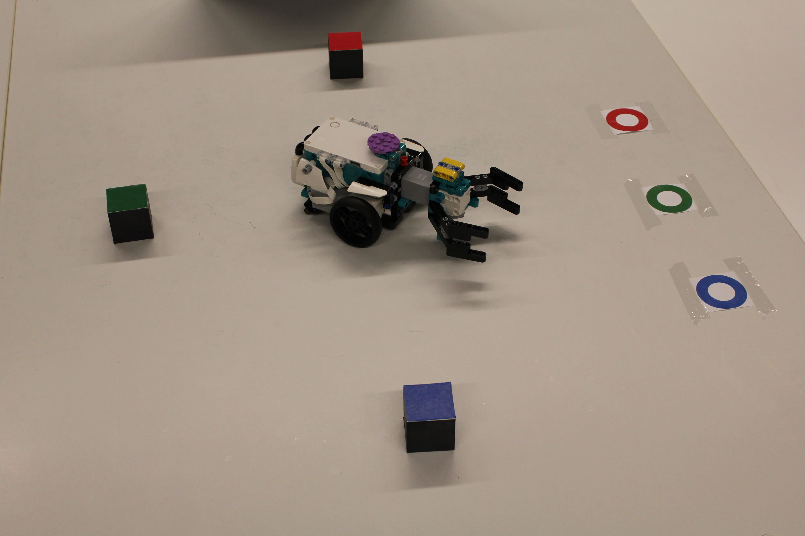

# 3DCV_project

Practical assignment in 3D Computer Vision -course.

## Functionality

1. Calibration
2. Object detection
3. Guiding the robot
4. Extra: place all 3 cubes in a row using a single image

## Dependencies

```
matplotlib
opencv-python
scikit-image
scipy
pandas
```

## Usage

See [`assignment.ipynb`](./assignment.ipynb) 

## Stages

Brief explanations of the stages.

### Calibration

 

1. Build the setup in the image above and take
2. Take a new image and locate reference points from the image in given order.
3. Solve the camera matrix $M\in\mathbb{R}^{3\times 4}$ using normalized DLT.

### Object detection

 

1. Using hue channel from the HSI formatted image, segment
    1. bot: purple disk and yellow bars
    2. red/green/blue block and goal
2. Convert each segment coordinates from image coordinates $[x~ y]^T$ to world coordinates $[X ~Y ~Z]^T$. 

Knowing that
```math
\begin{bmatrix} x \\ y  \\ 1 \end{bmatrix} = M \begin{bmatrix} X \\ Y  \\ Z \\ W \end{bmatrix},
```
and since M and Z is known (height of each object is known in world coordinates w.r.t table), we have
```math
\begin{bmatrix} X \\ Y  \\ W \end{bmatrix} = M_{\{1, 2, 4\}}^{-1}\left( \begin{bmatrix} x \\ y  \\ 1 \end{bmatrix} - M_{\{3\}} Z \right).
```
Finally, set $X:=\frac{X}{W}$ and $Y:=\frac{Y}{W}$.
3. Compute center of mass for each segment in world coordinates $\rightarrow$ approximate location of each object.

### Guiding the robot

Using vector dot product property
```math
\frac{x \cdot y}{|x||y|} = \cos{\theta},
```
we can determine all necessary rotations for the bot. The angle is computed using `numpy.acos`, which returns always the smallest positive angle that satisfy the equation, hence it doesn't consider the rotation direction.

Fitting a line through the approximate locations of purple disk and yellow bars, the sign of the rotation angle can be determined: if the target is below the line, set the angle negative, otherwise positive.

Moreover, taking necessary Euclidean distances $|x-y|$, we can determine how far the bot must move in every occasion. The unit of world coordinates are in cm, hence additional conversions are not required.

